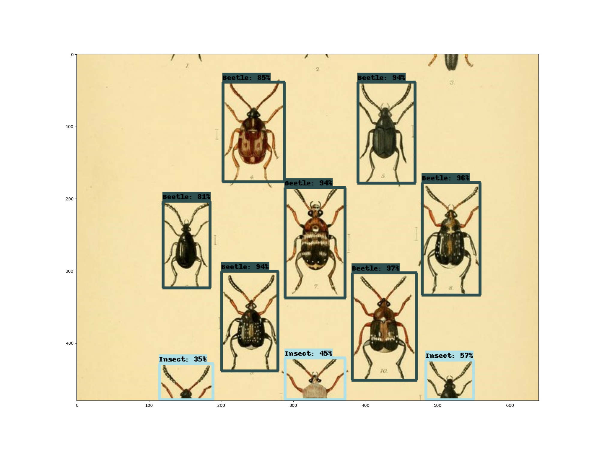

# tensorflow object identification in image example
the following is an adaptation of this [article](https://www.tensorflow.org/hub/tutorials/object_detection)
from a jupyter notebook into a working python program

images are specified in a list of url's in the "images.py" file.
the main file, identify.py then reads the url's from the list, processes them via
the "faster_rcnn_openimages_v4_inception_resnet_v2_1" object identification model.

## setup
* step 1: download the object identification model from [this](https://tfhub.dev/google/faster_rcnn/openimages_v4/inception_resnet_v2/1) url.
* step 2: move the tarball into the model dir, extract there.
* step 3 make dir inside of model dir with the same name as the tarball, .tar.gz extension omitted from dir name of course. 
the model's dir structure should look something like this:
```
model
└── faster_rcnn_openimages_v4_inception_resnet_v2_1
    ├── assets
    ├── saved_model.pb
    ├── tfhub_module.pb
    └── variables
```

### example

here is an example of some output that the model generates, given an image with identifiable objects in it.

